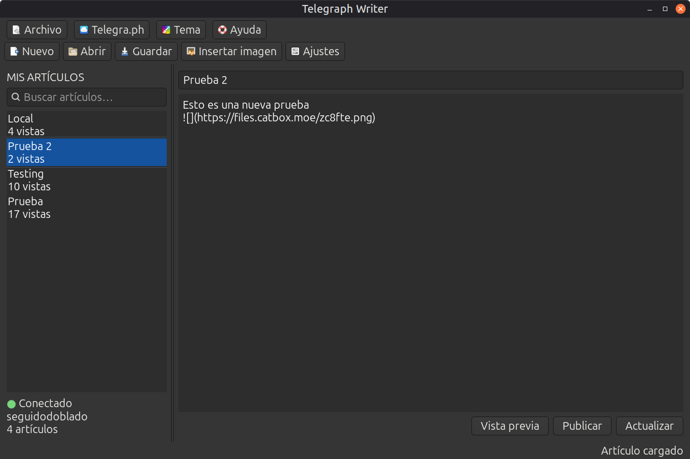

# Telegraph Writer


Aplicación de escritorio GTK4 para crear, editar y publicar artículos en [Telegra.ph](https://telegra.ph/). Incluye un editor Markdown sencillo, gestión de borradores locales y vista previa en el navegador.



## Características

- Crear y publicar artículos nuevos en Telegra.ph.
- Editar y actualizar artículos ya publicados.
- Consultar y abrir los artículos de una cuenta.
- Escribir usando Markdown y revisar el resultado en el navegador.
- Subir imágenes locales a Catbox e insertarlas automáticamente en el artículo.
- Guardar borradores localmente en archivos Markdown.
- Elegir entre modo claro y modo oscuro.
- Atajos de teclado para las operaciones habituales.

## Requisitos

- Linux con Python 3.10 o posterior.
- GTK4 y PyGObject (`python3-gi`, `gir1.2-gtk-4.0`).
- Una cuenta de Telegra.ph y su access token.

No necesita PySide6 ni un entorno virtual: utiliza las bibliotecas GTK4/PyGObject del sistema.

## Instalación

Descarga el paquete `.deb` desde la página de [Releases de GitHub](https://github.com/seguidodoblado/telegraph-writer/releases) e instálalo con:

```bash
sudo apt install ./telegraph-writer_x.x.x-x_all.deb
```

El archivo debe estar en el directorio actual o debes indicar su ruta completa.

## Ejecución desde el código fuente

Para desarrollo o pruebas, instala las dependencias del sistema y ejecuta:

```bash
sudo apt install python3 python3-gi gir1.2-gtk-4.0
python3 telegraph_writer_gtk.py
```

El código fuente está disponible en [GitHub](https://github.com/seguidodoblado/telegraph-writer) y en [Launchpad](https://git.launchpad.net/telegraph-writer).

## Configuración

1. Abre **Ajustes**.
2. Introduce el access token de tu cuenta de Telegra.ph.
3. Si quieres, elige una carpeta personalizada para los borradores locales. La ubicación predeterminada es `~/Telegra.ph`.
4. Guarda la configuración.

El access token y la carpeta de borradores se almacenan localmente en `~/.config/telegraph-writer/config.json`. Este archivo no se incluye en los artículos guardados ni en el repositorio.

## Imágenes y alojamiento externo

Las nuevas subidas de imágenes de Telegra.ph están actualmente deshabilitadas por el propio servicio. Por ese motivo, **Insertar imagen** utiliza [Catbox](https://catbox.moe/) como servicio alternativo de alojamiento.

La aplicación sube la imagen a Catbox, recibe una URL pública y la inserta en el artículo mediante Markdown. Esto permite que la imagen aparezca tanto en la publicación como en **Vista previa**, pero implica depender de la disponibilidad y de las condiciones de uso de Catbox. Las imágenes se almacenan externamente y no forman parte del borrador Markdown local.

## Flujo de trabajo

- Usa **Nuevo** para empezar un artículo.
- Usa **Guardar** para conservar una copia local en Markdown.
- Usa **Publicar** cuando el artículo todavía no exista en Telegra.ph.
- Usa **Actualizar** para aplicar cambios a un artículo ya publicado.
- Si se intenta publicar un artículo ya existente, la aplicación lo bloquea para evitar crear un duplicado.
- **Vista previa** abre una representación del artículo en el navegador.
- **Insertar imagen** sube una imagen compatible a Catbox y añade su referencia Markdown en el editor.

## Seguridad

El access token permite modificar los artículos de la cuenta. No lo compartas ni subas `~/.config/telegraph-writer/config.json` a un repositorio.

## Licencia

Consulta el archivo [`LICENSE`](LICENSE) incluido en el repositorio.
