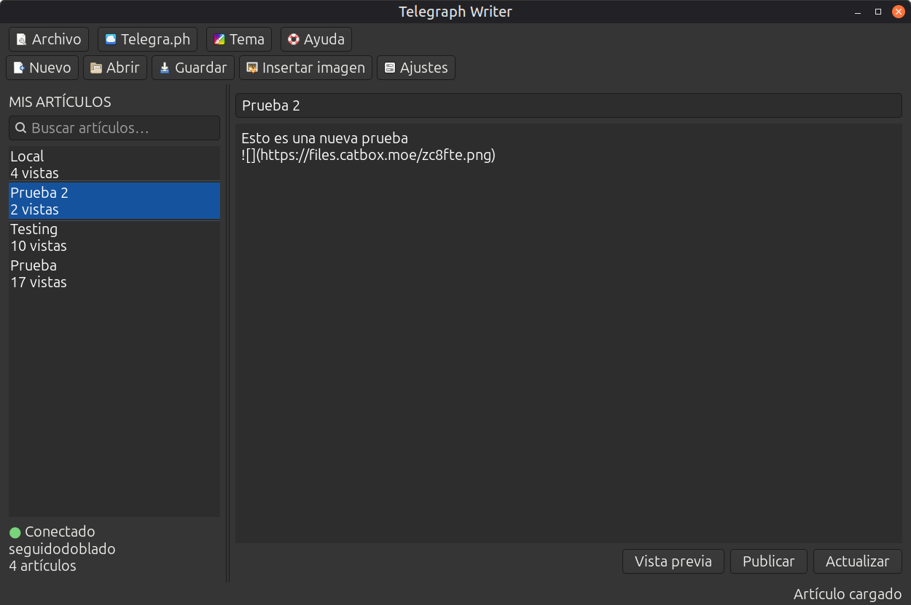

<a href="README.en.md">🇺🇸 English</a>

  

<h1 align="center">Telegraph Writer</h1>

  Escribe artículos en Markdown y publícalos en Telegra.ph, con vista previa fiel al resultado final.

  

Aplicación de escritorio (GTK 4 + PyGObject, interfaz en español), de uso personal: sin servidor propio ni cuenta
más allá de tu access token de Telegra.ph.

- **Escribe en Markdown** (encabezados, énfasis, enlaces, imágenes, listas, citas, código) en lugar del editor web
  de Telegra.ph.
- **Vista previa fiel**, en un panel junto al editor que se actualiza mientras escribes, tal como quedará
  publicado (necesita `gir1.2-webkit-6.0`; sin él se abre en el navegador).
- **Publica y actualiza** artículos de tu cuenta de Telegra.ph, con protección contra crear un duplicado por
  error.
- **Guarda borradores** localmente en archivos Markdown, además de en Telegra.ph.
- **Sube imágenes** a [Catbox](https://catbox.moe/) e insértalas automáticamente en el artículo, porque
  Telegra.ph tiene deshabilitadas las subidas nuevas.
- **Modo claro y oscuro**, con los iconos del sistema en cada uno.

## Documentación

Toda la documentación —instalación, guía de uso, especificaciones técnicas, solución de problemas y más— está en
la **[wiki del proyecto](https://github.com/seguidodoblado/telegraph-writer/wiki)** (español e inglés).

## Servicios de terceros

Telegraph Writer publica en tu propia cuenta de [Telegra.ph](https://telegra.ph/) mediante su API pública, con el
access token que tú mismo generas; la aplicación no aloja los artículos.

Las imágenes que insertas se suben a [Catbox](https://catbox.moe/), un servicio externo de alojamiento; quedan
fuera del control de la aplicación y sujetas a las condiciones de uso de Catbox.

## Licencia

Este proyecto se distribuye bajo la GNU General Public License, versión 3 (ver `LICENSE`).
